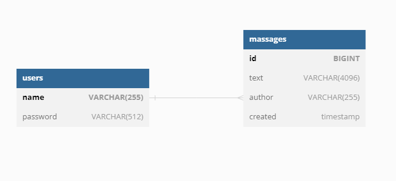

# Jwt_Test

### Проект задание на соискание должности Java-developer

Проект реализован с применением java 17, SpringBoot 2.7.6, Swagger, PostgreSql, Jsonwebtoken, Docker

Проект представляет собой прототип сервиса хранения сообщений пользователя.

Функциональность:
- авторизация по паре имя пользователя и пароль, для получения jwt токена.
- для тестирования в БД добавляется пользователь name: test, password : test
- сохранение сообщений пользователя
- получение истории сообщений (10 последних)

Эндпоинты:
POST /users  - авторизация
POST /messages - сохранение и получение истории.

Код покрыт тестами на 85%.

База данных - две таблицы объединённые связью foreignKey

Полное описание api можно посмотреть, открыв файл корневой директории [JwtTest-openapi.json](JwtTest-openapi.json),
в любом Swagger редакторе. [Например в этом](https://editor.swagger.io/).
Так же описание api будет доступно после запуска проекта по адресу http://{хост}:{порт}/swagger-ui/index.html

Для запуска проекта необходим установленный в системе Docker.

Проект запускается [скриптом](run.sh) - run.sh, который располагается в корне проекта.

Протестировать работоспособность проекта можно используя curl. 
Команды для тестов указаны в файле [curl_request.txt](curl_request.txt) находящемся в корне проекта.
Если при запуске вы изменили адрес и порт сервера, то необходимо можно заменить адрес и порт запроса при тесте. 

Контейнер с образом выложен на DockerHUb и доступен по ссылке [https://hub.docker.com/repository/docker/mikser256/jwt_test](https://hub.docker.com/repository/docker/mikser256/jwt_test)